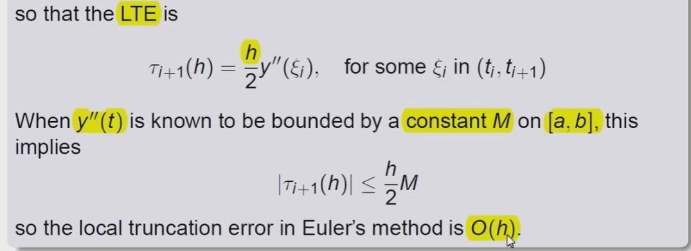
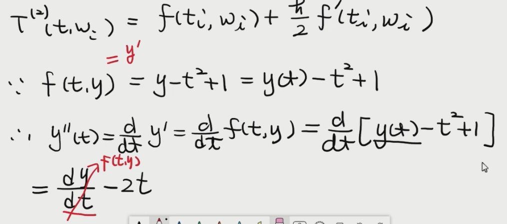
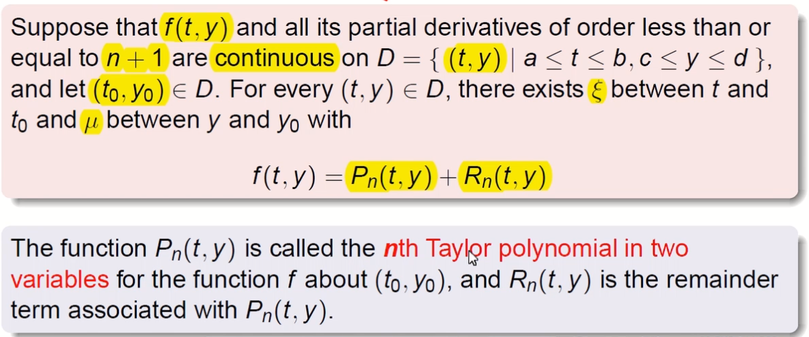
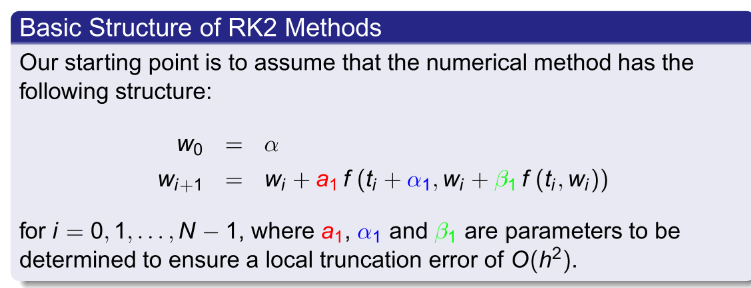

# 第五章：

## 第五章：Higher Order Taylor Method

## Local Truncation Error

### Example

using the Euler's method

 每一步的error means in every step

### Extrapolation

* 如何从EM推理得到LTE
* Derivative（y\(ti\)）== f\(ti,yi\)
* 所以：Derivative——Derivative（y\(ti\)） == Derivative（ f\(ti,yi\) ）

### Higher Order Taylor Method

FOR THE ORDER N IN THE TM

* 目标 improving the convergence properties of the difference methods

n+1 连续性

拥有更高维度的TM

### Exapmle

#### n=2

error会不断的积累

TM都会不断的积累误差

we need to compute the 4 terms for the following terms

## Local Truncation Error\(Taylor\)

* 对于不同的order LTE 也是不同的减小的 error呈现指数级的减小

由于我们的 TM本身是有error的

分析变量和error的关系我们需要将其他的part 减去

Derivative（y\(ti\)）== f\(ti,yi\)

通过对最后一项的分析

记住将h除去

## Runge-Kutta Methods

### Intro& TM in 2 variable

#### compare with TM

* 评估的过程非常的复杂（TM）
* 需要求导

#### 2 Variable of the TM

注意有reminder term存在

* the constant in the front is the C20 C21 C22

### RK M of order 2

首先我们需要知道

LTE for the TM of 2

RK2 的基本构造

保证LTE的情况之下

The algorithm of the RKM

### Example

### Higer-order of RKM

\#\#\#\#\#\#

